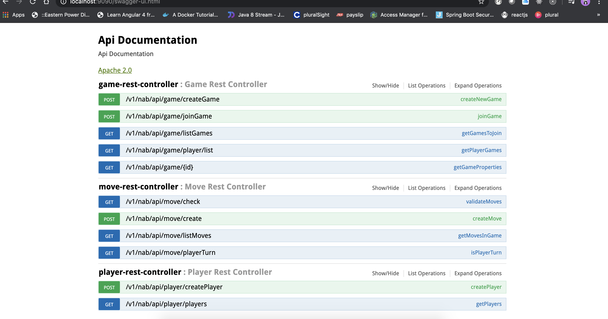

# TNABFraudCodingChallenge TicTacToe
This TicTacToe game developed using Java, Spring Boot with spring security.

##Install Tools
Gradle version 5.8 ,SDK JAva, IntelliJ, Docker

##Installation Steps :
1.Download and install Java and set the java home and path 
2.Download and install gradle and set the papth
3.Download and install Docker . 


##Dev Technologies   
SpringBoot, Mockito, In memoryDB, Java, Docker

##Swagger UI for endpoints 
http://localhost:9090/swagger-ui.html



##Basic Authentication
We have used basic authentication login form for our api's as i dont have any usr jwt provider , While executing any end point we need to provide the username and password . 
For testing purposes we have created two users . 

username and password :  john
username and password :  paul

Usually here in NAB we will use DAF for providing JWT reference and login .   


##PostMan URL's below 

For CreateGame : http://localhost:9090/v1/nab/api/game/createGame 
Basic Auth User Name and password : john 
Request Body : `{
               	"gameType": "COMPETITION",
               	"piece": "X"
               }`
               
Response : `{
               "gameId": 3,
               "secondPlayer": null,
               "firstPlayer": {
                   "playerId": 1,
                   "userName": "john",
                   "email": "john@gmail.com"
               },
               "firstPlayerPieceCode": "X",
               "gameType": "COMPETITION",
               "gameStatus": "WAITS_FOR_PLAYER",
               "created": "2020-06-17T12:02:58.176+0000"
           } `


To Join Game :

URL : http://localhost:9090/v1/nab/api/game/joinGame
Request Body : `{
               	"gameId": 3,
               	"gameType": "COMPETITION",
               	"piece": "O"
               }`
               
Response : 
`{
    "gameId": 3,
    "secondPlayer": {
        "playerId": 2,
        "userName": "paul",
        "email": "paul@gmail.com"
    },
    "firstPlayer": {
        "playerId": 1,
        "userName": "john",
        "email": "john@gmail.com"
    },
    "firstPlayerPieceCode": "X",
    "gameType": "COMPETITION",
    "gameStatus": "IN_PROGRESS",
    "created": "2020-06-17T10:19:31.796+0000"
}`


# To Start application and deploy it using docker 

## Run Local 
```shell script
gradle clean build 
gradle bootrun
```

## Docker
```shell script
gradle clean docker
```

